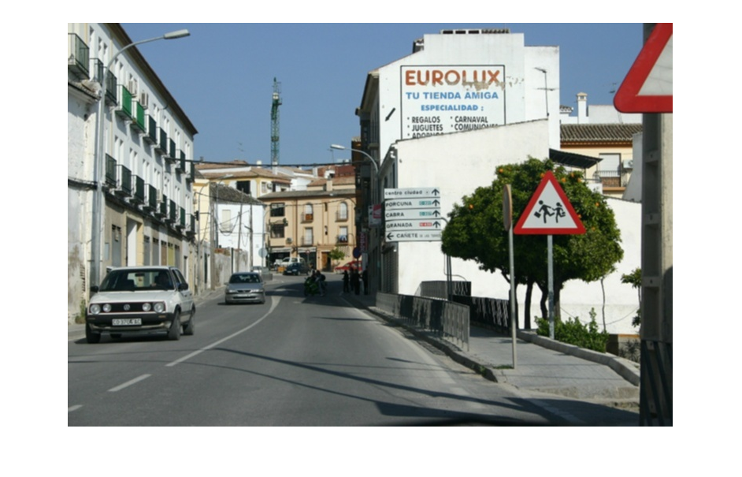
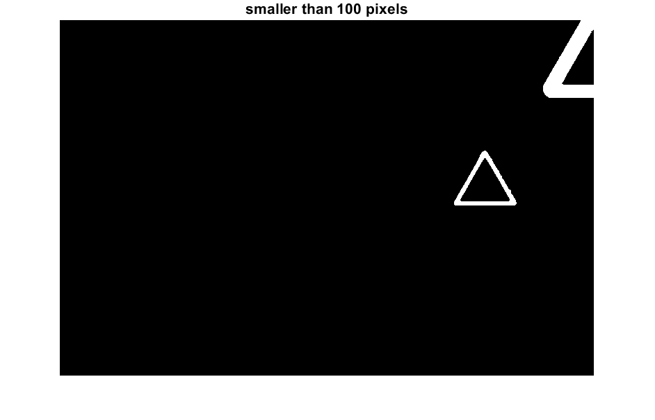
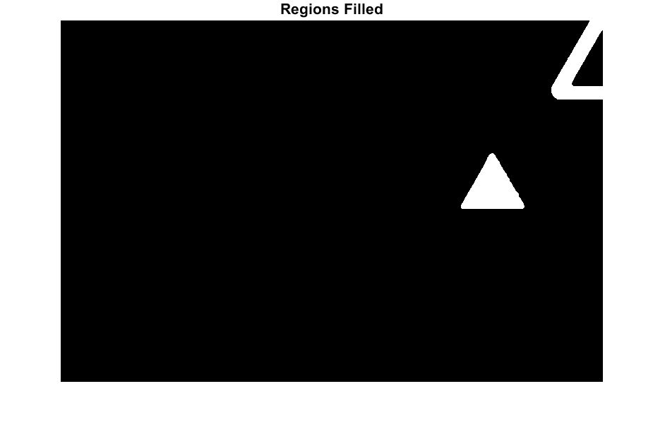
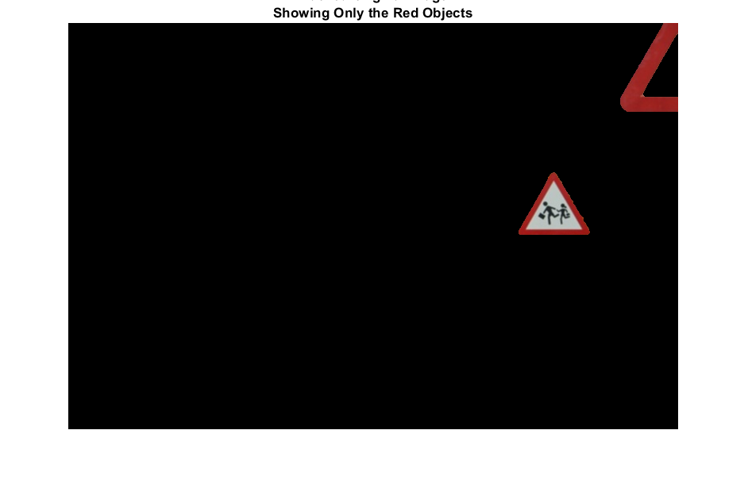
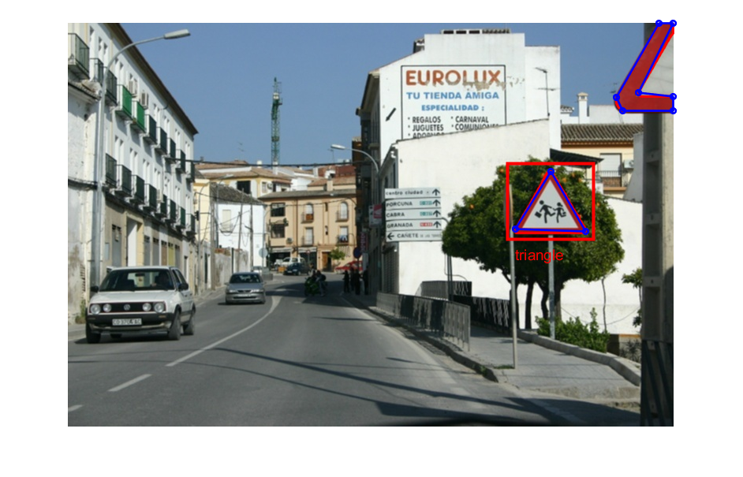

```matlab:Code
clear all
close all
[baseFileName, folder] = uigetfile('*.*', 'Specify an image file');
fullImageFileName = fullfile(folder, baseFileName);

if ~exist(fullImageFileName, 'file')
    message = sprintf('This file does not exist:\n%s', fullImageFileName);
    uiwait(msgbox(message));
    return;
end
```


```matlab:Code

%%
[rgbImage storedColorMap] = imread(fullImageFileName);
[rows columns numberOfColorBands] = size(rgbImage);
imshow(rgbImage)
```

# Original Image



```matlab:Code
redBand = rgbImage(:, :, 1);
greenBand = rgbImage(:, :, 2);
blueBand = rgbImage(:, :, 3);
fontSize = 16;

[redObjectsMask,maskedRGBImage] = createMask(rgbImage);
```


```text:Output
channel2Min = 0.5900
```


```matlab:Code

redObjectsMask= uint8(redObjectsMask);
imshow(redObjectsMask, []);
caption = sprintf('Mask of Only\nThe Red Objects');
title(caption, 'FontSize', fontSize);
```


```matlab:Code

%% keeping area larger than 100 pix

smallestAcceptableArea = 100;

% Get rid of small objects.  Note: bwareaopen returns a logical.
redObjectsMask = uint8(bwareaopen(redObjectsMask, smallestAcceptableArea));
figure
% subplot(1, 3, 1);
imshow(redObjectsMask, []);
caption = sprintf('bwareaopen() removed objects\nsmaller than %d pixels', smallestAcceptableArea);
title(caption, 'FontSize', fontSize);
```





```matlab:Code

```


```matlab:Code

%% Smooth the border using a morphological closing operation, imclose().
structuringElement = strel('disk', 4);
redObjectsMask = imclose(redObjectsMask, structuringElement);
% subplot(1, 3,2);
figure
imshow(redObjectsMask, []);
fontSize = 16;
title('Border smoothed', 'FontSize', fontSize);
```


```matlab:Code

%% Fill in any holes in the regions, since they are most likely red also.
redObjectsMask = uint8(imfill(redObjectsMask, 'holes'));
% redObjectsMask_1=imfill(redObjectsMask, 'holes');
% subplot(1, 3, 3);
figure
imshow(redObjectsMask, []);
title('Regions Filled', 'FontSize', fontSize);
```





```matlab:Code
%%
% You can only multiply integers if they are of the same type.
% (redObjectsMask is a logical array.)
% We need to convert the type of redObjectsMask to the same data type as redBand.
redObjectsMask = cast(redObjectsMask, class(redBand));

maskedImageR = redObjectsMask .* redBand;
maskedImageG = redObjectsMask .* greenBand;
maskedImageB = redObjectsMask .* blueBand;
maskedRGBImage = cat(3, maskedImageR, maskedImageG, maskedImageB);
% Show the masked off, original image.
figure
imshow(maskedRGBImage);
fontSize = 13;
caption = sprintf('Masked Original Image\nShowing Only the Red Objects');
title(caption, 'FontSize', fontSize);
```





```matlab:Code

```


```matlab:Code

%%

bw = redObjectsMask; %imbinarize(I);
bw_l = logical(bw) ;
%%
% Obtain the boundaries of all the coins in the binary image.
[B,L,N] = bwboundaries(bw,'holes');
STATS = regionprops(L, 'Centroid', 'Area', 'Perimeter','Circularity', 'Image'); % we need 'BoundingBox' and 'Extent'
Centroid = cat(1, STATS.Centroid);
Perimeter = cat(1,STATS.Perimeter);
Area = cat(1,STATS.Area);

numSidesDistance = FindNumberOfVertices(STATS, L);

CircleMetric = (Perimeter.^2)./(4*pi*Area);  %circularity metric
SquareMetric = NaN(N,1);
TriangleMetric = NaN(N,1);
```


```matlab:Code

%%
% Plot the boundary for one of the coins over the original image.
hf = figure;
imshow(rgbImage)
hold on;
dividingValues = PlotTheoreticalCircularity;

for k=1:length(B)
    boundary = B{k};
    stats=  STATS(k);
    
    
    
    
    plot(boundary(:,2), boundary(:,1), 'r', 'LineWidth', 2)
%     [rx,ry,boxArea] = minboundrect( boundary(:,2), boundary(:,1));  %x and y are flipped in images
%     width = sqrt( sum( (rx(2)-rx(1)).^2 + (ry(2)-ry(1)).^2));
%     height = sqrt( sum( (rx(2)-rx(3)).^2+ (ry(2)-ry(3)).^2));
%     aspectRatio = width/height;
%     if aspectRatio > 1,
%         aspectRatio = height/width;  %make aspect ratio less than unity
%     end
%     SquareMetric(k) = aspectRatio;    %aspect ratio of box sides
%     TriangleMetric(k) = Area(k)/boxArea;  %filled area vs box area
%     Requires MinBoundSuite
%     %for each boundary, fit to bounding box, and calculate some parameters
    
    % Use |reducepoly| to reduce the number of points defining the coin boundary.
    p = [boundary(:,2) boundary(:,1)];
    tolerance = 0.08; % choose suitable tolerance
    p_reduced = reducepoly(p,tolerance);
    % p_reduced = unique(p_reduced,'row')
    plot(p_reduced(:,1),p_reduced(:,2),...
        'color',[0 0 1],'linestyle','-','linewidth',2,...
        'marker','o','markersize',5)
    
    thisBlob = stats.Image;
    allBwAreas = bwarea(thisBlob);
    allPerimeters = stats.Perimeter;
    bwCircularities = (4 * pi *  allBwAreas) ./ allPerimeters.^2;
    %==============================================================
    % Determine the number of sizes according to the circularity
    % Get the circularity of this specific blob.
    thisCircularity = bwCircularities %sortedCircularities(blobNumber);
    % See which theoretical dividing value it's less than.
    % This will determine the number of sides it has.
    numSidesCircularity = find(thisCircularity < dividingValues, 1, 'first');
    % Assign a string naming the shape according to the distance algorithm.
    if numSidesCircularity == 3
        % Blob has 3 sides.
        theShapeCirc = 'triangle';
    elseif numSidesCircularity == 4
        % Blob has 4 sides.
        theShapeCirc = 'square';
    elseif numSidesCircularity == 5
        % Blob has 5 sides.
        theShapeCirc = 'pentagon';
    elseif numSidesCircularity == 6
        % Blob has 6 sides.
        theShapeCirc = 'hexagon';
    else
        % Blob has 7 or more sides.
        theShapeCirc = 'nearly circular';
    end
    
    %==============================================================
    % Determine the number of sizes according to the centroid-to-perimeter algorithm
    % Classify the shape by the centroid-to-perimeter algorithm which seems to be more accurate than the circularity algorithm.
    numSidesDist = numSidesDistance(k);
    % Assign a string naming the shape according to the distance algorithm.
    if numSidesDist == 3
        % Blob has 3 sides.
        theShapeDistance = 'triangle';
    elseif numSidesDist == 4
        % Blob has 4 sides.
        theShapeDistance = 'square';
    elseif numSidesDist == 5
        % Blob has 5 sides.
        theShapeDistance = 'pentagon';
    elseif numSidesDist == 6
        % Blob has 6 sides.
        theShapeDistance = 'hexagon';
    elseif numSidesDist == 8
        % Blob has 6 sides.
        theShapeDistance = 'octagon';
        
    elseif numSidesDist>9
        % Blob has 7 or more sides.
        theShapeDistance = 'nearly circular';
    else
        theShapeDistance = 'abnormal Shape';
        
    end
    
    poly = polyshape(p_reduced);
    Peri = perimeter(poly);
    Area_l = polyarea(p_reduced(:,1),p_reduced(:,2));
    
    if numSidesDist>=3 || (CircleMetric(k) < 1.1)
        
        
        pos=[ min(p_reduced(:,1))-10,min(p_reduced(:,2))-10, abs(max(p_reduced(:,1))- min(p_reduced(:,1)))+20,abs(max(p_reduced(:,2))-min(p_reduced(:,2)))+20];
        rectangle('Position',pos,'EdgeColor','r','LineWidth',3)
        %             Combined = [CircleMetric(k), SquareMetric(k), TriangleMetric(k)];
        %         Txt = sprintf('C=%0.3f S=%0.3f T=%0.3f',  Combined(:));
        text(pos(1)+10,pos(2)+pos(4)+20, theShapeDistance,'Color','red','FontSize',14);
        
        
        
        
    end
    
    %     poly = polyshape(p_reduced)
    %     Peri = perimeter(poly);
    %     Area_l = polyarea(p_reduced(:,1),p_reduced(:,2));
    %
    %     if(Area_l>0.001*(rows*columns) && Peri<Area_l)
    %         if (TriangleMetric(k) < 0.6) || (SquareMetric(k)>0.9 || (CircleMetric(k) < 1.1)) %Area>0.008*(rows*columns) && Peri<Area
    %             if(length(unique(p_reduced,'row'))>=3)
    %                 pos=[ min(p_reduced(:,1))-10,min(p_reduced(:,2))-10, abs(max(p_reduced(:,1))- min(p_reduced(:,1)))+20,abs(max(p_reduced(:,2))-min(p_reduced(:,2)))+20];
    %                 rectangle('Position',pos,'EdgeColor','r','LineWidth',3)
    %                 Combined = [CircleMetric(k), SquareMetric(k), TriangleMetric(k)];
    %                 Txt = sprintf('C=%0.3f S=%0.3f T=%0.3f',  Combined(:));
    %                 text(pos(1)+10,pos(2)+pos(4)+20, theShapeDistance,'Color','red','FontSize',14);
    %
    %             end
    %         end
    %     end
    
end
```


```text:Output
bwCircularities = 0.6961
thisCircularity = 0.6961
```





```text:Output
bwCircularities = 0.3348
thisCircularity = 0.3348
```


```matlab:Code

```


```matlab:Code
function [BW,maskedRGBImage] = createMask(RGB)
%createMask  Threshold RGB image using auto-generated code from colorThresholder app.
%  [BW,MASKEDRGBIMAGE] = createMask(RGB) thresholds image RGB using
%  auto-generated code from the colorThresholder app. The colorspace and
%  range for each channel of the colorspace were set within the app. The
%  segmentation mask is returned in BW, and a composite of the mask and
%  original RGB images is returned in maskedRGBImage.

% Auto-generated by colorThresholder app on 10-May-2020
%------------------------------------------------------

% Convert RGB image to chosen color space
I = rgb2hsv(RGB);

% Define thresholds for channel 1 based on histogram settings
channel1Min_red = 0.900;
channel1Max_red = 0.051;

channel1Min_yellow = 0.103;
channel1Max_yellow = 0.157;

% Define thresholds for channel 2 based on histogram settings
channel2Min = 0.590 %0.328;
channel2Max = 1.000;

% Define thresholds for channel 3 based on histogram settings
channel3Min = 0.49;
channel3Max = 1.000;

% Create mask based on chosen histogram thresholds
sliderBW = ( ((I(:,:,1) >= channel1Min_red) | (I(:,:,1) <= channel1Max_red)) | ((I(:,:,1) >= channel1Min_yellow ) & (I(:,:,1) <= channel1Max_yellow)) ) & ...
    (I(:,:,2) >= channel2Min ) & (I(:,:,2) <= channel2Max) & ...
    (I(:,:,3) >= channel3Min ) & (I(:,:,3) <= channel3Max);
BW = sliderBW;

% Initialize output masked image based on input image.
maskedRGBImage = RGB;

% Set background pixels where BW is false to zero.
maskedRGBImage(repmat(~BW,[1 1 3])) = 0;

end

function dividingValues = PlotTheoreticalCircularity()
try
    dividingValues = []; % Initialize
    fontSize = 24;
    % For reference, compute the theoretical circularity of a bunch of regular polygons with different number of sides.
    % 	fprintf('Number of Sides     Theoretical Circularity\n');
    % Define an array with the number of sides we want to compute the circularity for.
    numSides = 3 : 16;
    for k = 1 : length(numSides)
        thisSideLength = numSides(k);
        % Compute the theoretically perfect circularity, if the polygons were perfect instead of digitized.
        circularity(k) = ComputeTheoreticalCircularity(thisSideLength);
    end
    % Plot the theoretical circularities on the curve with a cross.
    % 	plot(numSides, circularity, 'b+-', 'LineWidth', 2, 'MarkerSize', 20);
    % 	grid on;
    % 	hold on;
    xl = xlim(); % Get left and right x coordinates of the graph.
    % Plot theoretical lines in dark red.
    % 	darkRed = [0.85, 0, 0];
    % 	for k = 1 : length(numSides)
    % 		% Make theoretical line on the plot in a magenta color.
    % 		line(xl, [circularity(k), circularity(k)], 'Color', darkRed, 'LineWidth', 2);
    % % 		fprintf('     %d                  %f\n', thisSideLength, circularity(k));
    % 		if k < 7 % Only print text if it's not too crowded and close together.
    % 			% Make text with the true value
    % % 			message = sprintf('Theoretical value for %d sides = %.4f', thisSideLength, circularity(k));
    % % 			text(xl(1)+0.1, circularity(k) + 0.005, message, 'Color', darkRed);
    % 		end
    % 	end
    
    % 	% Set up figure properties:
    % 	% Enlarge figure to full screen.
    % 	set(gcf, 'Units', 'Normalized', 'OuterPosition', [0 0 1 1]);
    % 	% Get rid of tool bar and pulldown menus that are along top of figure.
    % 	set(gcf, 'Toolbar', 'none', 'Menu', 'none');
    % 	% Give a name to the title bar.
    % 	set(gcf, 'Name', 'Demo by ImageAnalyst', 'NumberTitle', 'Off')
    % 	drawnow; % Make it display immediately.
    %
    % 	title('Theoretical Circularities', 'FontSize', fontSize, 'Interpreter', 'None');
    % 	xlabel('Number of Sides', 'FontSize', fontSize);
    % 	ylabel('True Circularity', 'FontSize', fontSize);
    
    % Get the midpoint between one circularity and the one for the next higher number of sides.
    dividingValues = conv(circularity, [1, 1]/2, 'valid');
    % Prepend two zeros so that we can use this array as a lookup table where we pass in
    % the number of sides as an index and it tells us the dividing value between
    % that number of sides and one more than that.
    % For example, right now dividingValues(1) gives us the dividing value between 3 and 4
    % and dividingValues(3) gives us the dividing value between 5 and 6 (instead of between 3 and 4).
    dividingValues = [0, 0, dividingValues];
    % Now dividingValues(3) will give us the dividing value between 3 and 4.
    
    % 	% Put up red horizontal lines at the dividing values
    % 	hold on;
    % 	xl = xlim();
    % 	darkGreen = [0, 0.5, 0];
    % 	for k = 1 : length(numSides)-1
    % 		thisSideLength = numSides(k);
    % 		thisDividingValue = dividingValues(thisSideLength);
    % 		h = line(xl, [thisDividingValue, thisDividingValue], 'Color', darkGreen, 'LineWidth', 2, 'LineStyle', '--');
    % 		% 		h.LineStyle = '--';
    % 		% For the first 6, print the dividing value at the left just above the line.
    % 		% After 6 it would get too crowded
    % 		if k <= 6
    % 			theLabel = sprintf('Dividing value = %.4f', thisDividingValue);
    % 			text(xl(1)+0.1, thisDividingValue + 0.005, theLabel, 'Color', darkGreen);
    % 		end
    % 	end
    
catch ME
    errorMessage = sprintf('Error in function %s() at line %d.\n\nError Message:\n%s', ...
        ME.stack(1).name, ME.stack(1).line, ME.message);
    fprintf(1, '%s\n', errorMessage);
    uiwait(warndlg(errorMessage));
end
end

% https://en.wikipedia.org/wiki/Regular_polygon
% Which says A = (1/4) * n * s^2 * cot(pi/n)
function circularity = ComputeTheoreticalCircularity(numSides)
try
    sideLength = 1;
    perimeter = numSides * sideLength;
    area = (1/4) * numSides * sideLength^2 / tan(pi / numSides);
    circularity = (4 * pi * area) / perimeter ^2;
catch ME
    errorMessage = sprintf('Error in function %s() at line %d.\n\nError Message:\n%s', ...
        ME.stack(1).name, ME.stack(1).line, ME.message);
    fprintf(1, '%s\n', errorMessage);
    uiwait(warndlg(errorMessage));
end
end

% Now compute the number of vertices by looking at the number of peaks in a plot of distance from centroid.
function numVertices = FindNumberOfVertices(blobMeasurements, labeledImage)
try
    numVertices = 0; % Initialize.
    % Get the number of blobs in the image.
    numRegions = length(blobMeasurements);
    hFig = figure;
    promptUser = true; % Let user see the curves.
    
    % For each blob, get its boundaries and find the distance from the centroid to each boundary point.
    for k = 1 : numRegions
        % Extract just this blob alone.
        thisBlob = ismember(labeledImage, k) > 0;
        % 		if promptUser % Let user see the image.
        % 			cla;
        % 			imshow(thisBlob);
        % 		end
        % Find the boundaries
        thisBoundary = bwboundaries(thisBlob);
        thisBoundary = cell2mat(thisBoundary); % Convert from cell to double.
        % Get x and y
        x = thisBoundary(:, 2);
        y = thisBoundary(:, 1);
        % Get the centroid
        xCenter = blobMeasurements(k).Centroid(1);
        yCenter = blobMeasurements(k).Centroid(2);
        % Compute distances
        distances = sqrt((x - xCenter).^2 + (y - yCenter).^2);
        % 		if promptUser % Let user see the curves.
        % 			% Plot the distances.
        % 			plot(distances, 'b-', 'LineWidth', 3);
        % 			grid on;
        % 			message = sprintf('Centroid to perimeter distances for shape #%d', k);
        % 			title(message, 'FontSize', 15);
        % 			% Scale y axis
        % 			yl = ylim();
        % 			ylim([0, yl(2)]); % Set lower limit to 0.
        % 		end
        
        % Find the range of the peaks
        peakRange = max(distances) - min(distances);
        minPeakHeight = 0.5 * peakRange;
        % Find the peaks
        
        [peakValues, peakIndexes] = findpeaks(distances, 'MinPeakProminence', minPeakHeight);
        % Find the valueys.
        [valleyValues, valleyIndexes] = findpeaks(-distances, 'MinPeakProminence', minPeakHeight);
        numVertices(k) = max([length(peakValues), length(valleyValues)]);
        % Circles seem to have a ton of peaks due to the very small range and quanitization of the image.
        % If the number of peaks is more than 10, make it zero to indicate a circle.
        if numVertices(k) > 10
            numVertices(k) = 0;
        end
        
        % 		if promptUser % Let user see the curves.
        % 			% Plot the peaks.
        % 			hold on;
        % 			plot(peakIndexes, distances(peakIndexes), 'r^', 'MarkerSize', 10, 'LineWidth', 2);
        %
        % 			% Plot the valleys.
        % 			hold on;
        % 			plot(valleyIndexes, distances(valleyIndexes), 'rv', 'MarkerSize', 10, 'LineWidth', 2);
        %
        % 			message = sprintf('Centroid to perimeter distances for shape #%d.  Found %d peaks.', k, numVertices(k));
        % 			title(message, 'FontSize', 20);
        %
        % 			% The figure un-maximizes each time when we call cla, so let's maximize it again.
        % 			% Set up figure properties:
        % 			% Enlarge figure to full screen.
        % 			set(gcf, 'Units', 'Normalized', 'OuterPosition', [0 0 1 1]);
        % 			% Get rid of tool bar and pulldown menus that are along top of figure.
        % 			set(gcf, 'Toolbar', 'none', 'Menu', 'none');
        % 			% Give a name to the title bar.
        % 			set(gcf, 'Name', 'Demo by ImageAnalyst', 'NumberTitle', 'Off')
        %
        % 			% Let user see this shape's distances plotted before continuing.
        % 			promptMessage = sprintf('Do you want to Continue processing,\nor Cancel processing?');
        % 			titleBarCaption = 'Continue?';
        % 			button = questdlg(promptMessage, titleBarCaption, 'Continue', 'Cancel', 'Continue');
        % 			if strcmpi(button, 'Cancel')
        % 				promptUser = false;
        % 			end
        % 		end
    end
    close(hFig);
catch ME
    errorMessage = sprintf('Error in function %s() at line %d.\n\nError Message:\n%s', ...
        ME.stack(1).name, ME.stack(1).line, ME.message);
    fprintf(1, '%s\n', errorMessage);
    uiwait(warndlg(errorMessage));
end
end
```

